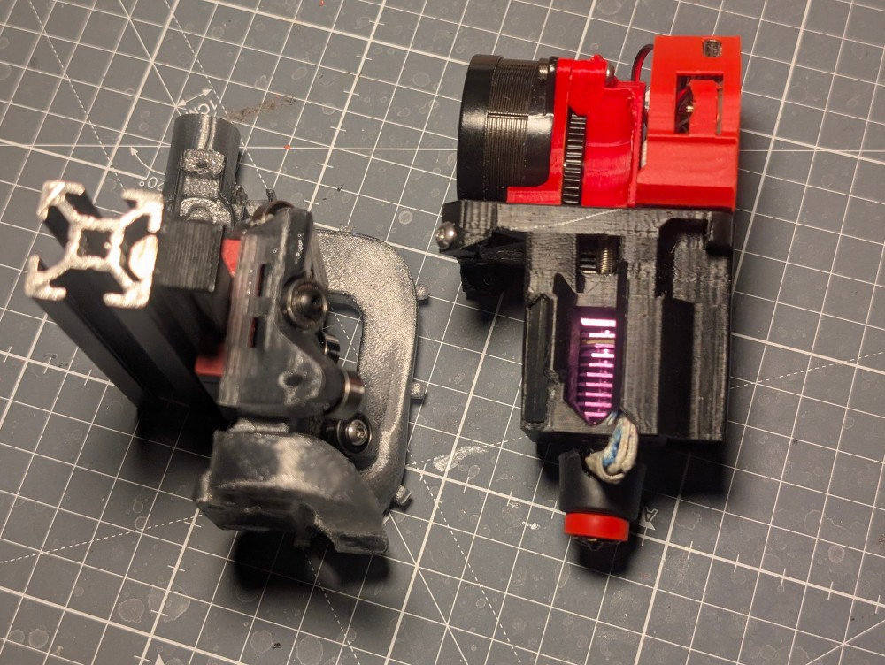

# Bearings tooleahd

## BOM Shuttle

Main bits:
* 6x 623zz bearings, note that voron 0 grooved variant will not work
* 2x 8mm d3 steel pin
* 6x m3 washer
* 4x m3 heatset insert
* 4x m3 16mm buttonhead screw
* a 3x6x2.5mm bearing (3x6x3 works too)

For CPAP
* CAP Fan
* ~1m 15mm diameter CPAP tube
* a 2gram micro servo, DSPOWER has worked well for me
* 2 m2x4 screws
* some servo wire
* (optional) Surface scanner probe - Cartogrpaher or Beacon

## BOM toolhead 

* 1 set of HGX Lite large gears 2.0 extruder gears and stepper
* 2x 3x3mmx42mm square steel rod, usually marketed as "Cutting tool bar" in Aliexpress
* a supported hotend
* a supported toolboard
* 30x30x10 axial fan for hotend cooling
* a Kailh Micro switch or compatible 3mm tall momentary switch
* 4x m3 6mm button head screw
* 1x m3 8mm button head screw
* 2x m3 14mm button head screw
* a piece of PTFE tube for filament guide
* 3x m3 heatset inserts

## BOM Dock
* 30 mm of 7x0.1mm springsteel, salvageable from 1m tape measure.
* High temp silicone for the nozzle pad
