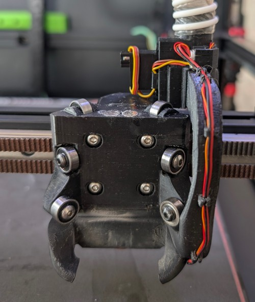
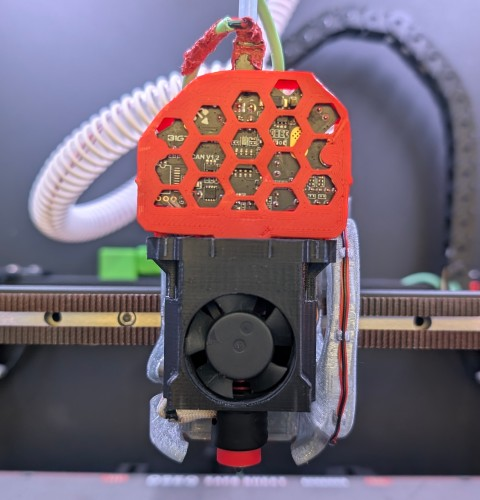
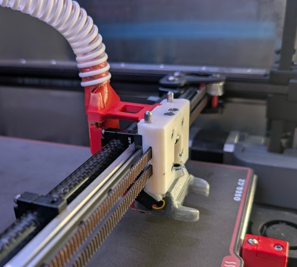
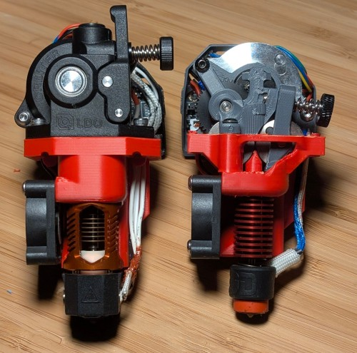

# Toolchanging toolhead designs for Voron 2.4

## Bearings variant

A minimalist toolhead using 10mm bearing for attachment and custom extruder design and CPAP based cooling.

 

## Pins variant

A skeletal toolhead using 4mm pins for attachment. Supporting various extruders.

  
